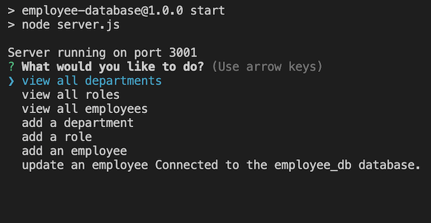
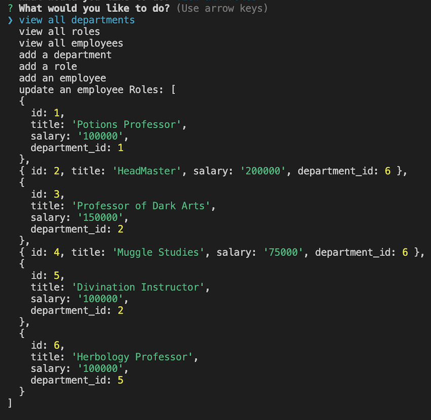

# Employee Database

## Table of Contents

* [Introduction](#introduction)
* [Features](#features)
* [Installation](#installation)
* [Technologies Used](#technologies-used)
* [Usage](#usage)
* [Screenshots](#screenshots)
* [Future Developments](#future-developments)
* [Contact](#contact)
* [Contributions](#contributions)
* [License](#license)
* [Demo](#demo)

## Introduction

This Employee Database is a command-line application that utilizes SQL in order to enable employers to access and manage information including their departments, roles, and employees in their company. 

## Features

* Ability to access all roles, departments, and users given user input.
* Ability to manage departments, roles, and employees by adding and updating employees given user input.

## Installation

This project may be accessed locally by following these steps:

1. Clone the repository to your local machine.
2. Install the necessary dependencies by running npm install.
3. Start the application by running npm run start in your terminal.

## Technologies Used

* SQL
* Express
* Inquirer

## Usage

* Install application by cloning the repository.
* Navigate to terminal and install dependencies.
* Enter 'npm run start' in the terminal.
* Choose either to access employees, departments, or roles; add an employee, role, or department; or update an employee role.
* Identify the formatted table of department information including department names and ids.
* Identify the formatted table of roles including job title, role id, the department the role belongs to, and the salary for that role.
* Identify the formatted table of employee information including employee ids, first names, last names, job titles, departments, salaries, and managers the employees report to.
* Enter the name of the department if user chose to add a department.
* Enter the name, salary, and department for the role if user chose to add a role to the database.
* Enter the first name, last name, role, and manager to add an employee to the database.
* Select an employee to update and their role if user chose to update an employees information.

## Screenshots

### Initial Prompted Question

### Access to Information

## Future Developments

* Add an interactive and scalable client folder to enhance user functionality.
* Add functionality to delete employee, role, or department.
* Add functionality to update role and department.

## Contact

If there are any questions or feedback, feel free to reach out via: 

* Github Issues: [Github](http://Github.com/Taylor-Brandon)

* Email: [Email](mailto://taylorbrandon.dev@gmail.com)

## Contributions

Special thanks to Columbia Bootcamps for providing the educational resources necessary to complete this project.

## License

## Demo

Demo Video 1: [View Here](https://drive.google.com/file/d/1r9wI-iVPvtnK1V0o5RcxIYZ20zlZhE2-/view?usp=drive_link)

Demo Video 2: [View Here](https://drive.google.com/file/d/1CTdROH9M4RG6TAdbAGdHSF0YsBs__4xT/view?usp=drive_link)
